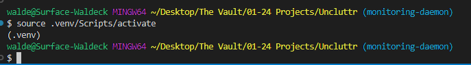

# Uncluttr

- Vérifier que poetry, est bien installé, si ce n'est pas le cas, faites la commande ```pip install poetry```, poetry étant un manager de package sur python

- Créer et activer votre venv avec
    - dans un terminal de préférence un bash
    - ```python -m venv .venv``` ou ```python -m venv```
    - ```source .venv/Scripts/activate```
    - normalement vous devriez voir un (.venv) dans votre terminal au dessus de la ligne où vous allez éxecuter vos futurs commandes 
    - 

- Lancer la commande ```poetry install```
- Lancer l'application à l'aide de la commande ```[to define]```, (pour l'instant: ```python -m uncluttr.core.main```)  ou :
    - ```python uncluttr/daemon/daemon.py``` si vous testez uniquement le daemon
    - ```python uncluttr/gui/gui.py``` si vous testez uniquement l'interface graphique
- pour l'arrêter, faire un ```CTRL+c``` dans le terminal où vous avez lancé l'application

- Installer un linter d'ailleurs si possible histoire de faire du code qui suit les conventions, genre l'extension ```Pylint``` sur vscode
- Et pensez à gérer vos exceptions, histoire d'éviter que ça crash

### Releases

- Dans la section **Releases** de github, vous pouvez retrouver le dernier ```.exe``` fonctionnel de l'application.
- Pour build un ```.exe```, lancer la commande ```pyinstaller --onefile --name Uncluttr --add-data "configuration/conf.ini;configuration" --add-data "configuration/document_keywords.json;configuration" --add-data "models/model_svm.joblib;models" --add-data "models/vectorizer_tfidf.joblib;models" --additional-hooks-dir=./uncluttr uncluttr/core/main.py```, vous retrouverez le ```.exe``` dans le dossier dist.
    - Si vous avez déjà build une fois, vous devriez avoir un fichier ```.spec```, auquel cas vous pouvez build avec ```pyinstaller Uncluttr.spec```