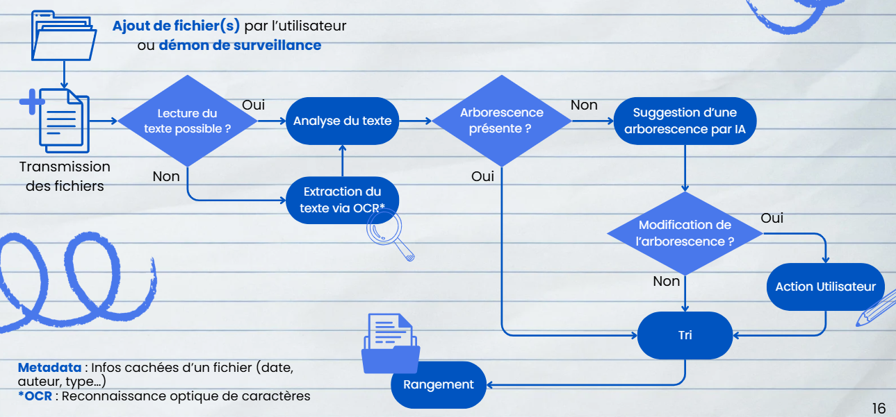
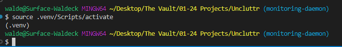
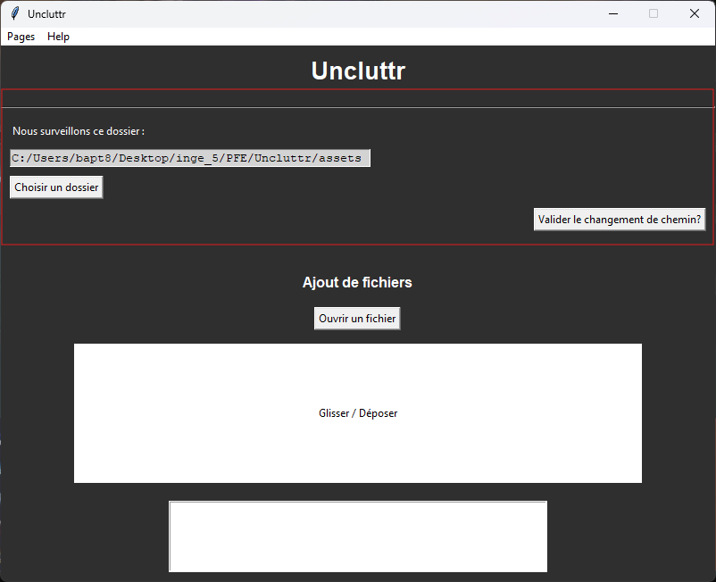
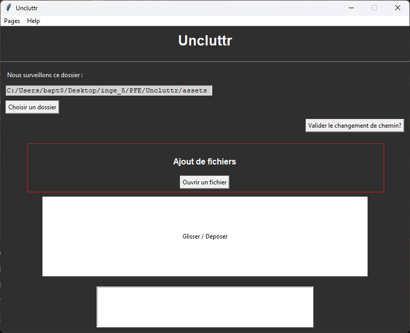
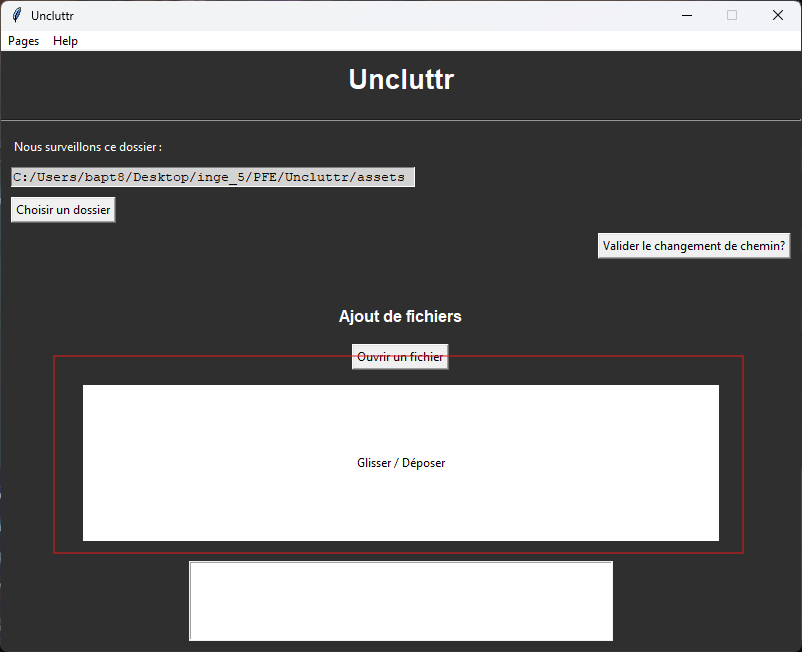
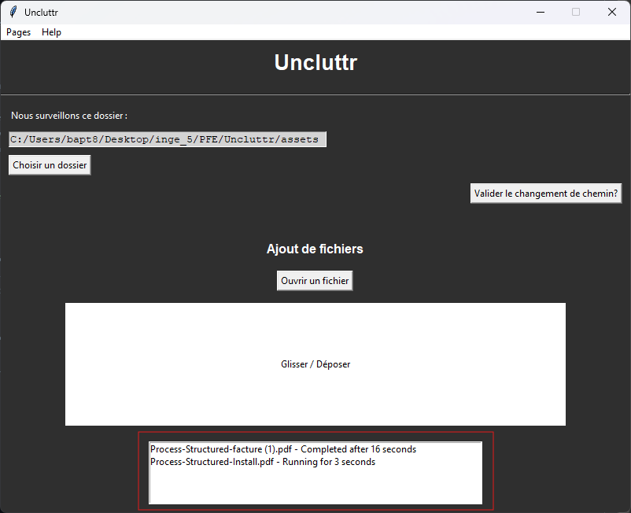
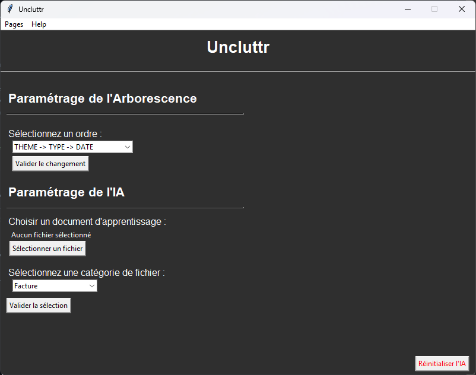
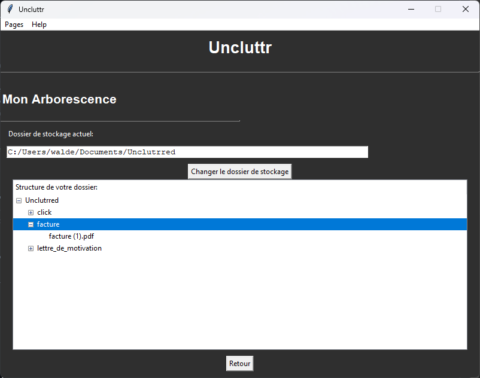

# Uncluttr

## Introduction

### Contexte du projet et objectifs globaux

Uncluttr vise à faciliter la numérisation et l’archivage intelligent des documents d’une entreprise grâce à un système automatisé de traitement et de tri. Les fichiers ajoutés sont analysés puis classés dynamiquement selon une arborescence évolutive, qui s’adapte à l’arrivée de nouveaux documents.

### Aperçu des Fonctionnalités Clés

- Surveillance de dossiers en temps réel via un démon de surveillance [(lien vers la doc).](https://waldk.github.io/Uncluttr/_autosummary/uncluttr.daemon.daemon.html)
- Extraction de texte via OCR pour les PDF non structurés et les images [(lien vers la doc).](https://waldk.github.io/Uncluttr/_autosummary/uncluttr.file_treatement.character_recognition.html)
- Prétraitement et analyse de texte [(lien vers la doc).](https://waldk.github.io/Uncluttr/_autosummary/uncluttr.file_treatement.text_preprocessing.html)
- Classification automatique des documents [(lien vers la doc).](https://waldk.github.io/Uncluttr/_autosummary/uncluttr.file_treatement.file_treatement.html)
- Ajout de métadonnées et création de tags [(lien vers la doc).](https://waldk.github.io/Uncluttr/_autosummary/uncluttr.file_treatement.metadata_custom.html)
- Organisation des documents dans une arborescence [(lien vers la doc).](https://waldk.github.io/Uncluttr/_autosummary/uncluttr.file_treatement.file_treatement.html)
- Interface graphique pour l'ajout et la consultation de fichiers, ainsi que la configuration de l'application [(lien vers la doc).](https://waldk.github.io/Uncluttr/_autosummary/uncluttr.gui.gui.html)

## Vue d'Ensemble du Projet

### Principaux Composants du Projet

- **[Daemon](https://github.com/Waldk/Uncluttr/blob/main/uncluttr/daemon/daemon.py)** : Surveillance des dossiers et déclenchement des traitements
- **[Interface Graphique](https://github.com/Waldk/Uncluttr/blob/main/uncluttr/gui/gui.py)** : Visualisation et ajustement du classement des documents
- **[Extraction de Texte](https://github.com/Waldk/Uncluttr/blob/main/uncluttr/file_treatement/character_recognition.py)** : Utilisation de l'OCR pour extraire le texte des PDF et images
- **[Prétraitement de Texte](https://github.com/Waldk/Uncluttr/blob/main/uncluttr/file_treatement/text_preprocessing.py)** : Nettoyage et lemmatisation du texte
- **[Analyse de Texte](https://github.com/Waldk/Uncluttr/blob/main/uncluttr/file_treatement/file_treatement.py)** : Classification et génération de thèmes
- **[Ajout de Métadonnées](https://github.com/Waldk/Uncluttr/blob/main/uncluttr/file_treatement/metadata_custom.py)** : Ajout de tags et métadonnées aux documents
- **[Organisation des Documents](https://github.com/Waldk/Uncluttr/blob/main/uncluttr/file_treatement/rangement.py)** : Création d'une arborescence pour le rangement des documents

### Diagramme d'Architecture Simplifié



## Installation de l'application

Dans la section **Releases** de github, vous pouvez retrouver le dernier ```.exe``` fonctionnel de l'application. Télécharger ce dernier et éxécuter le afin de pouvoir utiliser l'application. Pour le fonctionnement de cette dernière, consultez la section : [Prise en main de l'application](#prise-en-main-de-lapplication)

### Installation de l'Environnement de Développement

#### Guide Pas à Pas

Prérequis: 
- Disposer d'un IDE permettant d'utiliser Pythonn >3.12, <3.13 (**[Guide d'Installation de Python](https://www.python.org/about/gettingstarted/)**).
- cloner le dépôt à l'emplacement désiré à l'aide de la commande 
```sh
git clone https://github.com/Waldk/Uncluttr.git
```

1. **Installer Poetry** :
```sh
pip install poetry
```

3. **Installer les Dépendances** :
```sh
poetry install
```
L'utilisation de poetry devrait automatiquement générer un environnement virtuel prêt à l'emploi.

Si ce n'est pas le cas, créer et activer un environnement virtuel :
```sh
python -m venv .venv
source .venv/Scripts/activate
```
- vous devriez voir un (.venv) dans votre terminal au dessus de la ligne où vous allez éxecuter vos futurs commandes 

puis utiliser la commande :
```sh
poetry install
```

4. **Lancer l'Application** :
```sh
python -m uncluttr.core.main
```

## Prise en main de l'application

### Présentation de la Structure du Code Source

- **[core](https://github.com/Waldk/Uncluttr/tree/main/uncluttr/core)** : Contient le code principal de l'application
- **[daemon](https://github.com/Waldk/Uncluttr/tree/main/uncluttr/daemon)** : Contient le code du démon de surveillance
- **[gui](https://github.com/Waldk/Uncluttr/tree/main/uncluttr/gui)** : Contient le code de l'interface graphique, cette dernière utilisant tkinter
- **[file_treatement](https://github.com/Waldk/Uncluttr/tree/main/uncluttr/file_treatement)** : Contient les modules de traitement de fichiers

### Description Détailée des Principales Fonctionnalités

- On aura deux points d’entrée principaux pour le traitement des fichiers :
    - **Daemon de surveillance** : e manière éponyme, viendra observer l’ajout d’un fichier dans un dossier source, par défaut le dossier dans lequel les documents numérisés sont stockés, afin de déclencher le traitement de ces derniers.
    - **Interface Graphique** : l’ajout de fichiers effectués manuellement par un utilisateur via une IHM

- Le traitement sera effectué dans la méthode [file_analysis](https://github.com/Waldk/Uncluttr/blob/main/uncluttr/file_treatement/file_treatement.py#L178). On viendra ensuite observer le type et la structure du fichier afin de voir s'il s'agit d'un `.zip`, on le décompressera et traitera l'ensemble des fichiers, on vérifiera si le texte est consultable, comme par exemple pour un fichier texte ou un pdf dit structuré. Si ce n’est pas le cas comme dans des images ou des pdfs non structuré, on viendra transmettre les fichiers à un OCR, un outil de reconnaissance de caractères, afin d’en faire émerger le texte. 
    - **Extraction de Texte** : Utilisation de l'OCR pour extraire le texte des PDF et images ([`extract_pdf_text_ocr`](https://github.com/Waldk/Uncluttr/blob/main/uncluttr/file_treatement/character_recognition.py#L8))

- Une fois le texte obtenu, on viendra traiter ce dernier afin d'en extraire les informations clés via les modèles que l’on a entrainés, notamment le type de fichier, si c’est une facture, un contrat, ou bien encore le thème ou des dates clés.
    - **Prétraitement de Texte** : Nettoyage et lemmatisation du texte ([`preprocess_text`](https://github.com/Waldk/Uncluttr/blob/main/uncluttr/file_treatement/text_preprocessing.py#L52))
    - **Analyse de Texte** : Classification et extraction des informations clés ([`classifier_document`](https://github.com/Waldk/Uncluttr/blob/main/uncluttr/file_treatement/file_treatement.py#L151) et [`extract_date`](https://github.com/Waldk/Uncluttr/blob/main/uncluttr/file_treatement/file_treatement.py#L299))
    - **Ajout de Métadonnées** : Ajout des informations sous forme de tags aux métadonnées des fichiers ([`append_metadata_to_pdf`](https://github.com/Waldk/Uncluttr/blob/main/uncluttr/file_treatement/metadata_custom.py#L13))
- Enfin à l’aide de toutes ces informations on viendra ajouter le fichier dans le bon dossier en en créant si nécessaire.
    - **Organisation des Documents** : Création d'une arborescence pour le rangement des documents ([`rangement_fichier`](https://github.com/Waldk/Uncluttr/blob/main/uncluttr/file_treatement/rangement.py#L16))

- Ce processus pourra donc s'exécuter de manière fluide, sans interruption en tâche de fond à chaque document scanné, afin de ne pas alourdir le processus de travail de l’utilisateur.

- On retrouvera dans le dossier configuration le fichier [conf.ini](https://github.com/Waldk/Uncluttr/blob/main/configuration/conf.ini) afin de paramétrer différents paramètres de l'application.

- On pourra observer d'autres fonctionnalités au sein de l'interface graphique :
    - On pourra, en plus de le faire dans les fichiers de configuration, venir modifier le dossier qui sera surveillé par le daemon. 
    - On pourra chercher un fichier à traiter via l'explorateur de fichiers de Windows 
    - Il sera possible de faire un glisser-déposer (drag and drop) des fichiers directement dans l'interface afin de lancer le traitement de ces derniers. 
    - On pourra observer l'état des processus fils dédiés au traitement des fihciers 
    - Il sera possible de choisir un type de fichier spécifique afin d'affiner le modèle pour qu'il corresponde bien à la structure des fichiers de l'utilisateur. De plus, on pourra paramétrer les aspects sur lesquels mettre l'accent lors de la création de l'arborescence des dossiers. 
    - Enfin, une page dédiée permettra de consulter l'arborescence des dossiers et de naviguer facilement à travers les documents organisés. 

### Scénarios d'Utilisation Typiques

- Surveillance d'un dossier pour l'ajout de nouveaux fichiers
- Extraction et prétraitement du texte des documents ajoutés
- Classification automatique et ajout de métadonnées
- Organisation des documents dans une arborescence

### Fonctionnalités à venir

- Rendre le démarrage du daemon indépent du reste et automatique au démarrage
- Envoie de notifications à la fin du traitemennt d'un fichier
- amélioration de l'interface graphique
- Mise en place d'API plus efficace
- Rendre l'application compatible avec les appareils mobiles
- Améliorer les modèles de traitement des fichiers

### Releases

- Dans la section **Releases** de github, vous pouvez retrouver le dernier ```.exe``` fonctionnel de l'application.
- Pour build un ```.exe```, lancer la commande ```pyinstaller --onefile --name Uncluttr --add-data "configuration/conf.ini;configuration" --add-data "configuration/document_keywords.json;configuration" --add-data "models/model_svm.joblib;models" --add-data "models/vectorizer_tfidf.joblib;models" --additional-hooks-dir=./uncluttr uncluttr/core/main.py```, vous retrouverez le ```.exe``` dans le dossier dist.
    - Si vous avez déjà build une fois, vous devriez avoir un fichier ```.spec```, auquel cas vous pouvez build un exécutable avec la commande : ```pyinstaller Uncluttr.spec```
- **Mettre à jour la version** du logiciel dans `pyproject.toml`
- **Créer un tag Git** correspondant à la nouvelle version (`git tag -a vX.Y.Z -m "Version X.Y.Z"`)  
- **Pousser les modifications et le tag** avec : `git push origin main --tags`
- Dans la section github actions, vous trouverez des jobs vous permettant de réaliser des releases de façon automatisé

### Génération de la Documentation

Pour générer la documentation de votre projet Uncluttr, suivez ces étapes :

1. **Se Positionner sur la Branche `docs`** :
```sh
git checkout docs
```
penser à rebase si nécessaire la branche docs sur la main afin de prendre les dernières modifications en compte via la commande:
```sh
git rebaase main
```

2. **Générer les Fichiers `.rst` pour les Modules Python** :
```sh
sphinx-apidoc -o source/uncluttr/ ../uncluttr/
```

3. **Construire la Documentation HTML** :
```sh
sphinx-build -b html source/ docs/
```
Enfin, réaliser un commit et push ce dernier en ligne. Une fois ces commandes exécutées, les automatisations de GitHub Pages prendront le relais pour publier la documentation mise à jour. Vous pourrez alors consulter la documentation en ligne à l'adresse https://waldk.github.io/Uncluttr/.

## Bonnes Pratiques de Développement  

### Conventions de Codage  

- Respect de **PEP 8** pour un code propre et lisible  
- Documentation systématique avec des **docstrings**  
- Analyse du code avec **Pylint** pour détecter erreurs et incohérences  
- Gestion des erreurs via des **exceptions personnalisées**  
- Mise en place progressive de **tests unitaires** avec `unittest`  
- Organisation du projet en **modules et packages structurés**  
- Gestion des dépendances avec **Poetry** via `pyproject.toml`  

### Bonnes Pratiques et Outils  

- Utiliser des **environnements virtuels** pour isoler les dépendances  
- Vérifier la qualité du code avec **Pylint** et d'autres linters  
- Assurer une gestion robuste des erreurs pour éviter les crashs  
- Versionner le code avec **Git** et adopter les bonnes pratiques de collaboration (pull requests, revues de code)  

### Défis et Problèmes Rencontrés  

- Gestion des dépendances et compatibilité des versions de packages  
- Intégration de **l’OCR** et des modèles de traitement de texte  


Merci d'avoir exploré Uncluttr ! Nous espérons que ce projet vous sera utile et vous inspirera à contribuer et à améliorer encore plus cette solution. N'hésitez pas à explorer, apprendre et partager vos idées avec nous !

Pour plus de détails, consultez la [documentation complète](https://waldk.github.io/Uncluttr/).

## Contribution  

Si vous souhaitez contribuer au projet, n’hésitez pas ! Les corrections de bugs, améliorations, ajustements visuels, etc., sont toujours les bienvenus. Si vous envisagez d’implémenter une fonctionnalité majeure, merci d’ouvrir une discussion à ce sujet au préalable. La documentation contient des informations de base pour bien débuter.  


## Références Utiles

### Liens vers des ressources

- [Guide d'Installation de Python](https://www.python.org/about/gettingstarted/)
- [Poetry](https://python-poetry.org/)
- [Watchdog](https://pypi.org/project/watchdog/)
- Documentation de [spaCy](https://spacy.io/)
- Documentation de [PyInstaller](https://pyinstaller.org/en/stable/)
- [PEP 8 - Style Guide for Python Code](https://www.python.org/dev/peps/pep-0008/)
- Guide [Git](https://git-scm.com/book/en/v2)
- Documentation de [Pytest](https://docs.pytest.org/en/stable/)
- Documentation de [Pylint](https://pylint.pycqa.org/en/latest/)

### Informations de Contact

- Cérina ALLEK : cerina.allek@edu.ece.fr
- Waldeck FELIX : waldecklernst.felix@edu.ece.fr
- Rafael GONÇALVES : rafael.goncalves@edu.ece.fr
- Alban HOELLINGER : alban.hoellinger@edu.ece.fr
- Baptiste LE SCIELLOUR : baptiste.lesciellour@edu.ece.fr
- Eva SUPIOT : eva.supiot@edu.ece.fr
